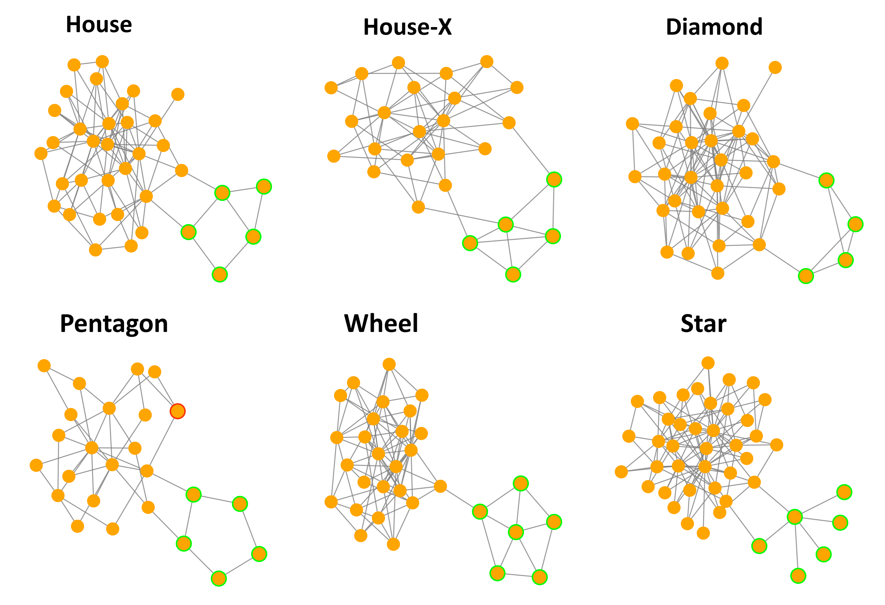

# FidGraphX

**Dual Fidelity Optimization for Explaining Graph Neural Networks**

*A new algorithm for graph explainability—now victorious in both classification **and** regression.*

---

> **TL;DR** FidGraphX learns to **minimise** Fidelity‑ (information kept) and **maximise** Fidelity+ (information discarded) with a single, elegant reward signal.
> The result? *State‑of‑the‑art* explanations across graph‑level classification **and** regression tasks.

## 🚀 Quick start

```bash
# clone and install
$ git clone https://github.com/daniel-unyi-42/FidGraphX && cd FidGraphX
$ docker build -t fidgraphx-explainer .
$ docker compose up

$ python main.py
```

> Checkpoints and TensorBoard logs drop into `runs/` by default.

## 🧠 Algorithm in two sentences

1. **Fid– minimisation** forces the *positive* predictor to mimic the baseline on the selected subgraph.
2. **Fid+ maximisation** pushes the *negative* predictor away on the complementary subgraph.

The difference **Fid– – Fid+** is the *reward* for REINFORCE updates.

## 📈 Benchmarks

| Dataset           | Task           | Metric | FidGraphX | MAGE         |
| ----------------- | -------------- | ------ | -------- | ------------ |
| BA‑Motifs         | classification | AUC ↑  | **0.99** | 0.85         |
| MNIST‑Superpixels | classification | AUC ↑  | **0.90** | 0.72         |

| Dataset           | Task           | Metric | FidGraphX | RegExplainer |
| ------------------| ---------------| ------ | -------- | ------------ |
| BA‑VolumeMotifs   | regression     | AUC ↑  | **0.94** | 0.76         |



## ✏️ Citing FidGraphX

```bibtex
@article{FidGraphX2025,
  title   = {FidGraphX: Dual Fidelity Optimization for Explaining Graph Neural Networks},
  author  = {Dániel Unyi, Beatrix Tugyi, Bálint Gyires-Tóth},
  journal = {arXiv preprint arXiv:????.?????},
  year    = 2025
}
```

## 📜 License

This project is released under the MIT License.

## Acknowledgement

Support by EU project RRF-2.3.1-21-2022-0004 within the framework of the Artificial Intelligence National Laboratory.
